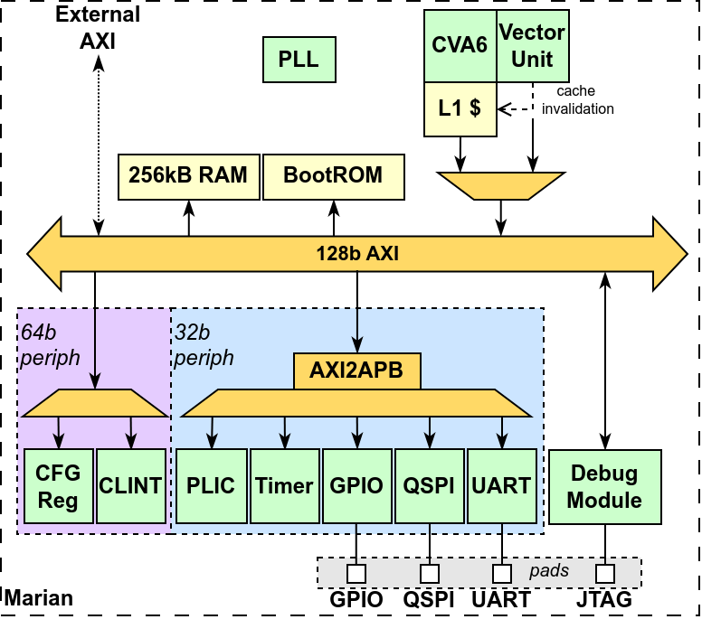

# Vector-Crypto Subsystem (Marian) for Bow SoC

## Contents
- [Getting Started](#getting-started)
  - [Repo Structure](#repo-structure)
  - [Dependencies](#dependencies)
  - [Hardware Compilation/Simulation](#hardware-compilationsimulation)
    - [Questasim](#questasim)
    - [Verilator](#verilator)
  - [Software Compilation](#software-compilation)
  - [FPGA Emulation](#fpga-emulation)
- [Marian Datasheet](#marian-datasheet)
  - [Marian Boot](#marian-boot)
  - [Memory Map](#memory-map)
    - [Subsystem Memory Map](#subsystem-memory-map)
  - [PLIC IRQ Mapping](#plic-irq-ids)
- [Git Guidance](#git-guidance)
  - [Development and Merge Operations](#development-and-merge-operations)
  - [Documentation](#documentation)
  - [Repository Pipeline Settings](#repository-pipeline-settings)
    - [General Pipelines](#general-pipelines)
    - [Runners](#runners)
    - [Token Access](#token-access)
  - [Pipeline Status](#pipeline-status)


The Vector Crypto Subsystem extends v3.0 of the Pulp RISC-V vector processor [Ara](https://github.com/pulp-platform/ara) to support Version 1.0.0 of the [RISC-V Vector Cryptography Extension](https://github.com/riscv/riscv-crypto) (Zvk).



## Getting Started

### Repo Structure

- **build**: Temporary directory that is created during the HW build flow. Contains logs and temporary artefacts. 
- **ci**: Artefacts related to Gitlab CI
- **doc**: Documents/Figures
- **formal**: Questa Formal tooling scripts
- **fpga**: FPGA prototyping script + artefacts
- **ips**: RTL of external IPs used within the projects
- **ipxact**: IPXACT definitions of IP to be used with Kactus2
- **scripts**: Helper scripts for simulation
- **src**: RTL and TB sources specific to this repository
- **sw**: Software artefacts used for testing 
- **syn**: Scripts used for Genus LEC and elaboration
- **verilator**: Artefacts related to Verilator simulation flow
- **vsim**: Artefacts related to Questa simulation flow

### Dependencies

- GNU Make >= 3.82
- Python >= 3.10
- RISCV GCC >= 13.2
- Questa 10.7g
- Verilator v5.008
- Vivado 2021.2
- RISC-V OpenOCD (tested with commit# 3991492, but latest should work)

### Hardware Compilation/Simulation

The following RTL simulation tools are supported with the versions specified:
- Questasim 10.7g
- Verilator v5.008

Initialise the project repo + submodules by using the command:

```
make repository_init
``` 
 
The primary method of testing the subsystem loads precompiled software binaries into L2 Memory and resumes execution. The return from main causes the simulation to finish and returns success or failure depending if zero or a non-zero value is respectively returned from main.

Precompiled binaries of selected Ara tests (found in [apps](https://github.com/pulp-platform/ara/tree/v3.0/apps)) have been converted to verilog _.mem_/_.hex_ files which can be read using the systemverilog `$readmemh` utility. They are stored within [/sw/hex](/sw/hex).

#### Questasim

Questasim is the primary tool used for verification. The following commands are used to compile the RTL:
```
make compile elaborate
```
All build files can be deleted using the command:
```
make clean
```
Use the following commands to run the marian_tb in simulation (more detailed documentation for the marian_tb can be found [here](./src/tb/README.md)):
```
make simc # runs simulation in CLI
make sim  # runs simulation in GUI
```
By default, the top module selected for simulation is the [marian_tb](/src/tb/marian_tb.sv). This can be modified through the use of the `TOP_MODULE` flag e.g. the following command will simulate the canright_sbox_tb in the CLI:
```
make simc TOP_MODULE=canright_sbox_tb 
```
By default, the software test selected to be loaded into memory (when simulating the marian_tb) is `hello_world`. This can be modified through the use of the `TEST` flag e.g. the following command will simulate marian_tb, loading `/sw/hex/exp.hex` into L2 memory in GUI mode:
```
make sim TEST=exp 
``` 
By default, Questa runs the [marian_tb.do](/vsim/do_files/marian_tb.do) when simulating. This can be modified to run a custom .do file through the use of the `VSIM_DOFILE` flag. Note that the path to the do file is relative to the `/build` directory e.g. the following command will run the .do file located under `../vsim/do_files/marian_tb_logged.do`:
```
make sim VSIM_DOFILE=../vsim/do_files/marian_tb_logged.do  
```
By default, Questa does not generate a .wlf. This can be modified through the use of the `WLF` flag e.g. the following command will generate a .wlf file with the name `<top_module>_waves.wlf`:
```
make simc GEN_WLF=1 
```
To perform testing using the memory models which are generated as a part of the synthesis flow, the `SYNTH_MEM` flag can be used. Note that when using the `SYNTH_MEM` flag, the memory sizing of the BootRAM is set independently within the simulation flow Makefile.  

The options above can be combined as required e.g. the following command will simulate marian_tb, loading the test `/sw/hex/softmax.hex`, using a custom (fictitious) .do file and generating a .wlf called `marian_tb_waves.wlf`:
```
make simc TEST=softmax GEN_WLF=1 VSIM_DOFILE=../vsim/do_files/my_do_file.do 
```

#### Verilator

The supported Verilator flow supports a subset of the Questasim functions. It is only possible to simulate the marian_tb using Verilator and the test option can be used to customise the software loaded into L2 memory.

**Note that the environment variable VERILATOR_ROOT should be set to the path of the Verilator installation directory!**

To build the verilated model, use the command:
```
make verilate
```
To run the simulation using the verilated model, use the command:
```
make simv
```
By default, the software test selected to be loaded into memory is `hello_world`. This can be modified through the use of the `TEST` flag e.g. the following command will run the verilated model of marian_tb, loading `/sw/hex/exp.hex` into L2 memory:
```
make simv TEST=exp 
``` 

### Software Compilation

See the [Software flow documentation](sw/README.md) for guidance on building SW. 

### FPGA Emulation

See the [FPGA flow documentation](fpga/README.md) for guidance relating to building the Marian FPGA prototype.

## Marian Datasheet

### Marian Boot

The boot process of Marian is described within [Marian Boot Process](./doc/marian_boot_process.md).

### Memory Map

#### Subsystem Memory Map

|      Name      | Start Address | End Address |  Size (Hex) |  Size |      Group      |
|:--------------:|:-------------:|:-----------:|:-----------:|:-----:|:---------------:|
|  Debug Module  |  0x0000_0000  | 0x0000_0FFF |    0x1000   |  4kiB |   Debug Module  |
| Ctrl Registers |  0x0000_2000  | 0x0000_2FFF |    0x1000   |  4kiB | 64b Peripherals |
|      CLINT     |  0x0000_3000  | 0x0000_3FFF |    0x1000   |  4kiB | 64b Peripherals |
|     BootROM    |  0x0000_5000  | 0x0000_5FFF |    0x1000   |  4kiB |      Memory     |
|  External AXI  |  0x4000_0000  | 0x7FFF_FFFF | 0x4000_0000 |  1GiB |     External    |
|     BootRAM    |  0x8000_0000  | 0x800F_FFFF |  0x10_0000  |  1MiB |      Memory     |
|      UART      |  0xC000_0000  | 0xC000_0FFF |    0x1000   |  4kiB | 32b Peripherals |
|      QSPI      |  0xC000_1000  | 0xC000_1FFF |    0x1000   |  4kiB | 32b Peripherals |
|      Timer     |  0xC000_2000  | 0xC000_2FFF |    0x1000   |  4kiB | 32b Peripherals |
|      GPIO      |  0xC000_3000  | 0xC000_3FFF |    0x1000   |  4kiB | 32b Peripherals |
|      PLIC      |  0xCC00_0000  | 0xCFFF_FFFF |  0x400_0000 | 64MiB | 32b Peripherals |

Note that a detailed memory map for each component in Marian can be found in [component_mem_maps.md](./doc/component_mem_maps.md)

### PLIC IRQ IDs

|     IRQ Source             | ID |
|:--------------------------:|:--:|
| APB Timer Overflow         |  0 |
|  APB Timer Compare         |  1 |
|        UART                |  2 |
|   QPSI Threshold           |  3 |
|   QSPI End of Transmission |  4 |
|        GPIO                |  5 |
|    External IRQ            |  6 |


