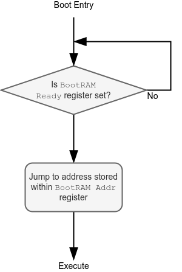

# Marian Boot Process

Out of reset, Marian starts executing code out of the BootROM. The code reads the contents of the `bootRAM ready` control register (address defined within [Component Memory Maps](./component_mem_maps.md#ctrl-registers)) and if it is not zero, execution will jump to the address contained within the `BootRAM addr` register.

The intended operating procedure is to lift the reset of Marian, load the executable code into the intended execution memory, set the value of `BootRAM addr` to be the entry point of execution and finally, set `BootRAM ready` to a non-zero value.

### FPGA Boot

Note that there is no way to easily set the `BootRAM ready` register on the FPGA prototype and therefore, the `BootRAM ready` register in the FPGA is fixed to '1' and Marian will immediately jump to the bootRAM address. 