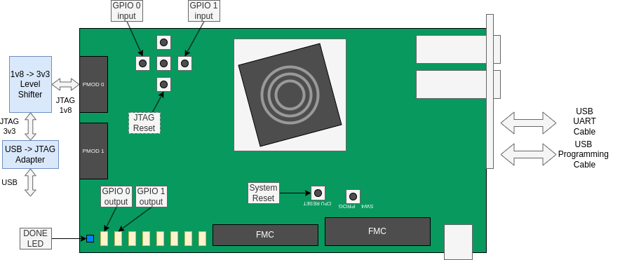
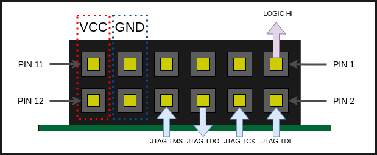

# FPGA Prototyping of Vector-Crypto Subsystem (Marian) for Bow

## Contents
- [Directory Structure](#directory-structure)
- [Getting Started](#getting-started)
  - [Prerequisites](#prerequisites)
  - [Command Usage](#build-command-usage)
- [FPGA Prototype Configuration](#prototype-configuration)
- [I/O Mapping](#io-mapping)
- [Running Code](#loadingrunning-code)

## Directory Structure

```
/fpga
|--/board_files
|--/build (tmp)
|--/constraints
|--/doc
|--/hdl
|  |--/include
|  |--/ip
|  |--/src
|  |--/tb
|--/ips
|--/scripts
|--/sim
|--/utils
```
- **build**: The output directory for build-related files. It includes subdirectories for Vivado projects, logs and temporary files. The final bitstream may be stored here. Note that this is a temporary directory and is never to be committed in version control.

- **board_files**: Contains board specific metadata (relevant to boards which do not have board files in Vivado already).

- **doc**: Contains detailed documentation, user guides, and any other relevant documentation.

- **hdl**: This is where the hardware description language (HDL) source code resides. It includes subdirectories for custom source files (src), headers/packages (include), ip-specific RTL (ip) and testbenches (tb).

- **ips**: If the project uses any vendor IPs, the build scripts and source files can be stored in this directory. Note that multiple IPs have been used during the development of the Marian FPGA prototype and not all of them have remained within the final design. The files for these IPs have been preserved in case they are used again in future.

- **constraints**: Holds any constraint files (e.g., Xilinx Design Constraints - XDC files) that define the timing and placement constraints for the FPGA design.

- **sim**: Contains simulation-related files. For example, simulation scripts can be stored here.

- **scripts**: Houses various scripts used in the project, such as build scripts or deployment scripts.

-**utils**: Holds ancillary items used when interacting with the FPGA prototyping project e.g. openOCD scripts and memory initialisation files. 

## Getting Started

### Prerequisites

Vivado 2021.2 has been used to develop the FPGA prototype for Marian. While it is possible that you can run the flow with a different version of Vivado, be warned, there is no guarantee that you will achieve the same results. Therefore, it is recommended that you use 2021.2.

The FPGA prototype targets the AMD-Xilinx VCU118 board.

For software compilation, the prerequisites mentioned within [sw/prerequisites](../sw/README.md) must be satisfied.

The [RISC-V fork of OpenOCD](https://github.com/riscv-collab/riscv-openocd) is used to connect to the debug module of Marian.

To be able to load and execute code, you will need to have access to a JTAG adapter and a level shifter (during testing, we have used the Texas Instruments TXS0206AEVM). See [Loading/Running Code](#Loading/Running-Code) for details.

### Build Command Usage

To generate a bitstream the Marian FPGA prototype, use the following command:
```
make all
```

To synthesise all of the IPs in isolation from the remainder of the design:
```
make all_ips
```

To delete all of the current build artefacts:
```
make clean_all
```

To delete build artefacts, but preserve IP synthesis artefacts:
```
make clean_top
```

To delete only the IP synthesis artefacts:
```
make clean_ips
```

## Prototype Configuration

The following values are used for the default configuration of the Marian prototype:

 | Configuration Item         | Value |
|----------------------------|-------|
| Number of Lanes            | 4     |
| vlen (bits)                | 512   |
| BootRAM Depth (rows)       | 16384 |
| Main Clock Frequency (MHz) | 75    |


## I/O Mapping


| Signal Name  | FPGA Pin ID | Board Component Reference |
|--------------|-------------|---------------------------|
| System Reset | L19         | CPU Reset (SW5)           |
|              |             |                           |
| UART TX      | BB21        | Micro USB UART            |
| UART RX      | AW25        | Micro USB UART            |
|              |             |                           |
| GPIO 0 (in)  | BE32        | Push Button East (SW9)    |
| GPIO 1 (in)  | BF22        | Push Button West (SW6)    |
| GPIO 0 (out) | AT32        | LED 0                     |
| GPIO 1 (out) | AV34        | LED 1                     |
|              |             |                           |
| JTAG rstn    | BB24        | Push Button South (SW10)  |
| JTAG TCK     | AU16        | PMOD0 - Pin 4             |
| JTAG TDI     | AV16        | PMOD0 - Pin 2             |
| JTAG TDO     | AT15        | PMOD0 - Pin 6             |
| JTAG TMS     | AT16        | PMOD0 - Pin 8             |
|              |             |                           |
| Logic Hi     | AY14        | PMOD0 - Pin 1             |

The following figure highlights the relevant board components used by the Marian FPGA prototype. Note that a level shifter is shown in the image as the FTDI JTAG adapter that has been used requires a VCC of 3V3, but the output of PMOD0 on the VCU118 used the VADJ_1V8_FPGA voltage. This is also the reason for the "Logic Hi" output which provides a reference logic level to use with level shifters.




The following figure shows the connections using PMOD0.



## Using the Prototype

### Loading Bitstream

Once the build command for the FPGA prototype has been used and the flow has completed successfully, a bitstream will have been generated and stored under `/fpga/build/marian_fpga.bit`.

The bitstream can be loaded onto the FPGA using the standard in-system programming facility provided by Vivado (see Chapter 4 of *UG908 (v2021.2) Vivado Design Suite User Guide: Programming and Debugging* for details).

The blue "DONE LED" will be illuminated once the bitstream has been loaded.

### Software Compilation

The same software compilation flow that is used in simulation can be used to compile code targeting the FPGA prototype. The only item to consider is that the `mock_uart` module is not present on the FPGA prototype and therefore compilation must used the `REAL_UART` flag (see [software flow guide](../sw/README.md#uart-configuration)).


### Loading Code

#### Connect OpenOCD

Before loading code, we need to establish a connection to the Debug Module of Marian using OpenOCD. During testing, we have used the FT2232H Mini-module as the USB->JTAG adapter. It should still be possible to follow these general instructions using a different device, however, minor modification may need to be made to example artefacts.

OpenOCD can be invoked to use a custom configuration file, which includes information relating to the target as well as the JTAG adapter. An [example configuration file](./utils/ft232_openocd_marian.cfg) is available (specific to the FT2232H Mini-module).

After all of the hardware is connected and the bitstream has been loaded to the FPGA, connect to and halt the CVA6 by using the following command:

```
openocd -f ./ft232_openocd_marian.cfg
```

If successful, the following text (or something close) should be displayed:

```
Open On-Chip Debugger 0.12.0+dev-03744-g3991492cc (2024-04-19-17:06)
Licensed under GNU GPL v2
For bug reports, read
        http://openocd.org/doc/doxygen/bugs.html
Info : clock speed 1000 kHz
Info : JTAG tap: riscv.cpu tap/device found: 0xf007ba11 (mfg: 0x508 (Warrior Technology), part: 0x007b, ver: 0xf)
Info : [riscv.cpu] datacount=2 progbufsize=8
Info : [riscv.cpu] Vector support with vlenb=64
Info : [riscv.cpu] Examined RISC-V core
Info : [riscv.cpu]  XLEN=64, misa=0x8000000000b4112d
[riscv.cpu] Target successfully examined.
Info : [riscv.cpu] Examination succeed
Info : starting gdb server for riscv.cpu on 3333
Info : Listening on port 3333 for gdb connections
riscv.cpu halted due to debug-request.
Ready for Remote Connections
Info : tcl server disabled
Info : telnet server disabled
```

#### Troubleshooting OpenOCD

OpenOCD issues can be difficult to debug. The following show two common scenarios which you may encounter, and what you should do to fix them.

##### 1. Issues with the JTAG adapter

If the following message is presented when you try to run OpenOCD:

```
Open On-Chip Debugger 0.12.0+dev-03744-g3991492cc (2024-04-19-17:06
Licensed under GNU GPL 
For bug reports, 
        http://openocd.org/doc/doxygen/bugs.
Error: unable to open ftdi device with description '*', serial '*' at bus location 
Error: [riscv.cpu] Unsupported DTM version: -
Error: [riscv.cpu] Could not identify target type.
```

This is related to the connection between your PC and the JTAG adapter. There are multiple possible reasons that you could be seeing this. Some of these are:
- You have not connected the USB adapter
- You do not have the correct user privileges to connect to the adapter (try using sudo)
- You have not configured the `ftdi vid_pid` or another configuration parameter correctly within the openOCD configuration file.

Make sure that your configuration file is correct (there are some examples of configuration files targeting various adapters within the RISC-V OpenOCD Repo: [here](https://github.com/riscv-collab/riscv-openocd/tree/riscv/tcl/interface))

##### 2. Issues with the FPGA connections

If the connections between the JTAG adapter and the FPGA are not correctly made (or the voltage levels are not correct), you may see something like this:

```
Open On-Chip Debugger 0.12.0+dev-03744-g3991492cc (2024-04-19-17:06)
Licensed under GNU GPL v2
For bug reports, read
        http://openocd.org/doc/doxygen/bugs.html
Info : clock speed 1000 kHz
Error: JTAG scan chain interrogation failed: all ones
Error: Check JTAG interface, timings, target power, etc.
Error: Trying to use configured scan chain anyway...
Error: riscv.cpu: IR capture error; saw 0x1f not 0x01
Warn : Bypassing JTAG setup events due to errors
Error: [riscv.cpu] Unsupported DTM version: 15
Error: [riscv.cpu] Examination failed
Warn : target riscv.cpu examination failed
Info : starting gdb server for riscv.cpu on 3333
Info : Listening on port 3333 for gdb connections
Error: Target not examined yet
                                                                                                                
Error: [riscv.cpu] Unsupported DTM version: -1
Error: [riscv.cpu] Could not identify target type.
```

There are a few variations of this type of error. However, the main item to notice is that openOCD is attempting to interrogate the scan chain and therefore is able to communicate with the adapter. Some common causes of the error are:
- The wiring between the JTAG adapter and the FPGA is wrong. You should look at the image above, the FPGA [constraints](./constraints/marian_fpga_VCU118_constraints.xdc) and the datasheet of the JTAG adapter to confirm that the wiring is correct.
- The voltage levels of the JTAG are not correct. As show above, the adapter we have tested with used a VCC of 3V3, but the FPGA PMOD is 1V8. If you do not match the signal levels, it is possible that the adapeter will not read data on TDO correctly.
- The FPGA is empty. 

##### 3. JTAG TAP State

After successfully connecting OpenOCD to Marian, if you close the session (e.g. using `ctrl+c`) it does not leave the JTAG TAP of Marian gracefully and it needs to be reset manually. If you attempt to reconnect openOCD without resetting the TAP, you will see this:

```
Open On-Chip Debugger 0.12.0+dev-03744-g3991492cc (2024-04-19-17:06)
Licensed under GNU GPL v2
For bug reports, read
        http://openocd.org/doc/doxygen/bugs.html
Info : clock speed 1000 kHz
Info : TAP riscv.cpu does not have valid IDCODE (idcode=0x0)
Info : TAP auto0.tap does not have valid IDCODE (idcode=0x0)
Info : TAP auto1.tap does not have valid IDCODE (idcode=0x0)
Info : TAP auto2.tap does not have valid IDCODE (idcode=0x80000000)
Info : TAP auto3.tap does not have valid IDCODE (idcode=0x40000000)
Info : TAP auto4.tap does not have valid IDCODE (idcode=0x20000000)
Info : TAP auto5.tap does not have valid IDCODE (idcode=0x10000000)
Info : TAP auto6.tap does not have valid IDCODE (idcode=0x88000000)
Info : TAP auto7.tap does not have valid IDCODE (idcode=0x44000000)
Info : TAP auto8.tap does not have valid IDCODE (idcode=0x22000000)
Info : TAP auto9.tap does not have valid IDCODE (idcode=0x91000000)
Info : TAP auto10.tap does not have valid IDCODE (idcode=0xc8800000)
Info : TAP auto11.tap does not have valid IDCODE (idcode=0xe4400000)
Info : TAP auto12.tap does not have valid IDCODE (idcode=0xf2200000)
Info : TAP auto13.tap does not have valid IDCODE (idcode=0xf9100000)
Info : TAP auto14.tap does not have valid IDCODE (idcode=0xfc880000)
Info : TAP auto15.tap does not have valid IDCODE (idcode=0xfe440000)
Info : TAP auto16.tap does not have valid IDCODE (idcode=0xff220000)
Info : TAP auto17.tap does not have valid IDCODE (idcode=0xff910000)
Info : TAP auto18.tap does not have valid IDCODE (idcode=0xffc88000)
Info : TAP auto19.tap does not have valid IDCODE (idcode=0xffe44000)
Warn : Unexpected idcode after end of chain: 21 0xfff22000
Error: double-check your JTAG setup (interface, speed, ...)
Error: Trying to use configured scan chain anyway...
Warn : AUTO auto0.tap - use "jtag newtap auto0 tap -irlen 2 -expected-id 0x00000000"
Error: auto0.tap: IR capture error; saw 0x0003 not 0x0001
Warn : Bypassing JTAG setup events due to errors
Error: [riscv.cpu] Could not read dtmcontrol. Check JTAG connectivity/board power.
Error: [riscv.cpu] Examination failed
Warn : target riscv.cpu examination failed
Info : starting gdb server for riscv.cpu on 3333
Info : Listening on port 3333 for gdb connections
Error: Target not examined yet
                                                                                                                                                           
Error: [riscv.cpu] Unsupported DTM version: -1
```

If this happens, you can push the `JTAG rstn` button briefly and then attempt to connect openOCD again. 

#### Using GDB

After successfully connecting to the debug module using openOCD, it is possible to load an executable into the bootRAM of Marian using GDB. Connect using openOCD and in a new terminal, run the following command:

```
riscv64-unknown-elf-gdb <path_to_elf>
```

This will start the GDB session with the selected binary. You can connect to the previously started openOCD session using:

```
target extended-remote localhost:3333
```

Note that the port ID for GDB is configured within the openOCD configuration script. The default value is 3333

You can then load the binary into memory using the `load` command. If successful, you should see something similar to:

```
(gdb) load
Loading section .text, size 0x51fa lma 0x80000000
Loading section .rodata, size 0x4998 lma 0x80005200
Loading section .sdata, size 0x9f lma 0x80009ba0
Start address 0x0000000080000000, load size 39985
Transfer rate: 68 KB/sec, 7997 bytes/write.
(gdb)
```

You can then continue to execute code using GDB as normal (e.g. `continue` to execute after loading code, more info [here](https://openocd.org/doc/html/GDB-and-OpenOCD.html)).